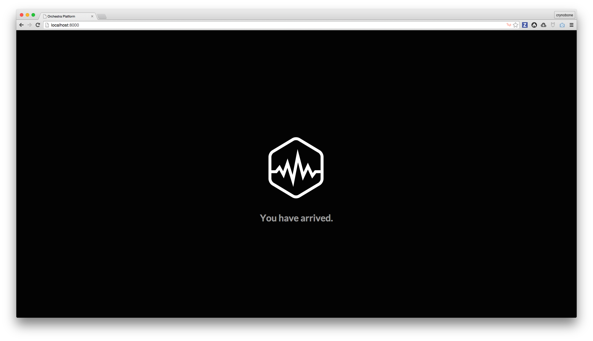

# Installation

Getting started with Orchestra Platform 3 is as much identical to getting started with Orchestra Platform 2. Therefore you need to have some minimum knowledge on [Laravel 5](http://laravel.com), [Composer](https://getcomposer.org) and [Packagist](https://packagist.org).

I would highly recommend watching [Laravel 5 Fundamentals](https://laracasts.com/series/laravel-5-fundamentals) and [What's New in Laravel 5.1](https://laracasts.com/series/whats-new-in-laravel-5-1) video series from [Laracasts](https://laracasts.com) in order to get familiar with Laravel 5 to understand some of the approach we use in Orchestra Platform 3.

## Downloading via Composer

Firstly, run the following command to download Orchestra Platform 3 using Composer:

    $ composer create-project orchestra/platform patio "3.1.x" --prefer-dist

This composer command would create a new project for you on `patio` folder using the latest development build, `--prefer-dist` is another option that you can use to indicate that you want to download a distributed version instead of cloning the repository, otherwise use `--prefer-source`.

Once composer finish installing the dependencies you can navigate the the project directory.

    $ cd patio

To test that everything is working, you may use the Serve command:

    $ php artisan serve
    Laravel development server started on http://localhost:8000/

Now open <http://localhost:8000> and you should see our splash screen.



## Setting up Homestead

This process is optional, but I highly recommend doing it for developing Orchestra Platform on your local mashine. Homestead give you full access to feature that we can use with Orchestra Platform. You can read the full documentation from [Laravel Homestead](http://laravel.com/docs/5.1/homestead).

Now, if you haven't use Homestead before, you probably need to add the box:

	vagrant box add laravel/homestead
	
Once you have it downloaded, let run the following command in your project directory.

	composer require --dev "laravel/homestead=^2.1"
	
Once composer has installed the dependencies, you can start adding Homestead support for your project by running the following command:

    ./vendor/bin/homestead make

> This action will create `Vagrantfile` and `Homestead.yaml` on your project root directory.

### Update Homestead.yaml

The generated `Homestead.yaml` will generally good enough to get you started, but let's open it and inspect the following:

| Key          | Description
|:------------|:---------------------
| ip          | Ensure that `ip` is unique and is not being use by other VM or machine in your intranet.
| hostname    | You can either use the default or customize it based on your preferences. 
| name        | You can either use the default or customize it based on your preferences.
| sites       | Make sure you map all the possible domain for your application.
| databases   | Make sure you type in the database name that you want to use for your application.

Here's an example how I configured it on my machine.
 
```yaml
---
ip: "192.168.50.10"
memory: 2048
cpus: 1
hostname: patio
name: patio
provider: virtualbox

authorize: ~/.ssh/id_rsa.pub

keys:
    - ~/.ssh/id_rsa

folders:
    - map: "/Users/crynobone/Sites/patio"
      to: "/home/vagrant/patio"

sites:
    - map: patio.app
      to: "/home/vagrant/patio/public"

databases:
    - patio

variables:
    - key: APP_ENV
      value: local
```

Now we can start provisioning the VM.

    vagrant up
