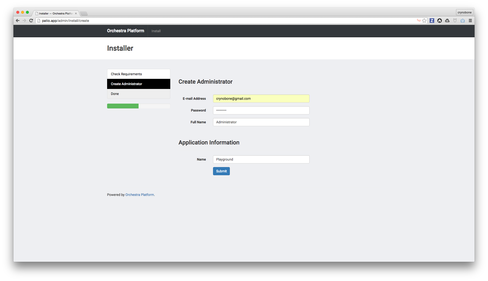
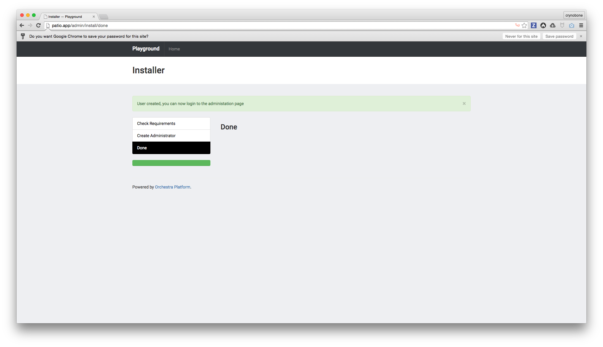

## Installing Orchestra Platform

To start the installation, navigate to <http://patio.app/admin>.

### Check Requirement

This page in general allows you to see if there any unfulfilled requirement that would disallow you from using Orchestra Platform properly. 

You should be able to install if you have configure everything properly.

### Create Administrator User

The installation is keep to minimum, for initial installation you would just need to key-in your e-mail address, full name and a password. You can also pick a name for the current application. For this project I picked "Playground".

### Done

The installation is just that simple. On later chapter we would look at how we can hook into Laravel event system to customize the first installation for project that requires it.